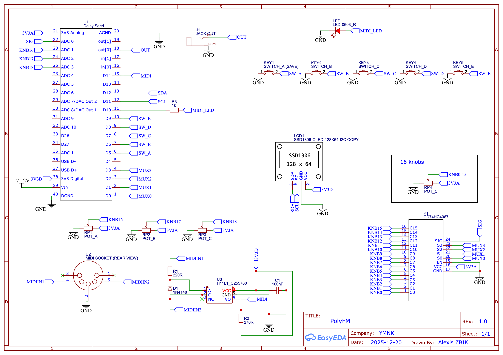

# PolyFM

## Overview

**PolyFM** is a 4-voice polyphonic FM synthesizer based on the **Daisy Seed** microcontroller.

It features a **4-operator FM engine** with up to **11 different algorithms**, allowing a wide range of classic and experimental FM sounds.

---

## Features

- 4-voice polyphony  
- 4-operator FM synthesis  
- 11 FM algorithms  
- MIDI input
- 16 presets save & load  
- OLED display (SSD1306 128×64)  
- Hands-on control with potentiometers and push buttons  

---

## Schematic



---

## Bill of Materials (BOM)

- 1× Daisy Seed  
- 1× CD74HC4067 multiplexer  
- 19× 10kΩ potentiometers  
- 1× Audio output jack  
- 1× MIDI input  
- 1× H11L1 optocoupler  
- 1× LED  
- 1× 1kΩ resistor (LED current-limiting, adjust depending on LED color and brightness)  
- 1× 220Ω resistor  
- 1× 270Ω resistor  
- 1× 100nF capacitor  
- 5× Normally Open (NO) push buttons* 
- 1× OLED screen SSD1306 (128×64)  

---

## Flashing the Microcontroller

First, clone this repository **including all submodules**:

```bash
git clone --recurse-submodules https://github.com/alexiszbik/PolyFM.git
```

To flash the Daisy Seed, please refer to the official Daisy documentation:

https://daisy.audio/

Go to Software → C++ → Tutorials and follow the instructions to install the toolchain and flash the firmware.
